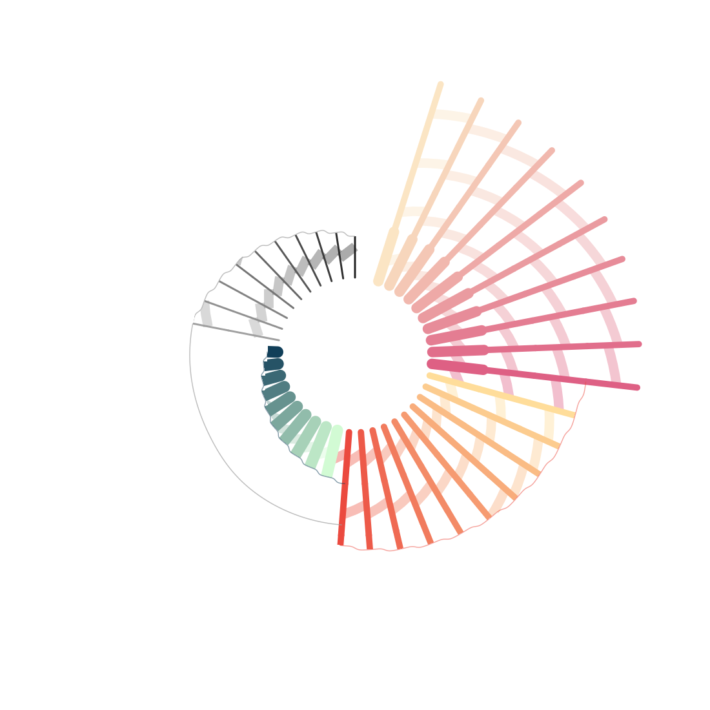

<p align="center">䷎</p>
# ䷎ 

This repository contains all data[^1] and scripts to reproduce the results presented in the study "*Questioning Neanderthal admixture*" (doi: https://doi.org/10.1101/2023.04.05.535686). It also contains the `demes`-formatted encoding of the twenty accepted scenarios from the introduced structured model. Scripts can further be re-used to perform novel simulations or inference.

At the root of the repository are five directories. All relevant information can be found in the README files of each respective directory.

| Folder         | Description                                 |
|----------------|----------------------------------------------|
| **archives**       | Stores simulated genetic data[^1], `demes`-formatted histories, observed statistics, empirical genetic maps.   |
| **bin**            | Stores external softwares.          |
| **param_files**    | Stores parameter files for all types of analyses.     |
| **scripts**        | Stores the *python3* scripts.    |
| **scripts_slurm**  | Stores *bash* scripts for analyses run on SLURM. |


At the root of the repository are also five files:

| Scripts         | Description                                 |
|----------------|----------------------------------------------|
| **general.sh** |  ***Bash* pipeline to simulate genetic data[^1] (incl. aDNA) and compute genetic summary statistics.** Note that if you want to re-run all the pipeline from scratch, you'll need to perform the *run selection* analysis (within `analyses.R`) after simulating the *n* data from the  parameter prior distributions (corresponds to the first entry of the `general.sh`  script). |
| **further.sh** | ***Bash* pipeline to perform additional simulations and analyses:** for robustness assessment (cf. SupMat). |
| **analyses.R** | ***R* script for all statistical analyses:** run selection, model comparison, and all figure plotting. |

| Files         | Description                                 |
|----------------|----------------------------------------------|
| **bo_1k5f.est** | Specifies the structured model and the prior distribution of parameters. |
| **published.est** | Specifies the prior distribution of the mutation rate (per generation) to simulate *published* models. |

# :large_blue_diamond: Setup

Download the repository archive. For easier installation (to avoid changing absolute paths), create a directory in your HOME folder: `~/gitdir/qna` and uncompress the archive content inside.

If you want to simulate data for other runs that the ones selected for the study, you'll have to change the values of these variables in the `further.sh` file: `ACCEPTED_RUNS_LIST_FILE` & `ACCEPTED_RUNS_PAR_DIR`

## Dependencies

For **python3**, using `pip3 install X`:
- allel *[>= 1.3.5]*
- argparse
- copy
- decimal
- demes *[>= 0.2.2]*
- gzip
- logging
- msprime *[>=1.1.0]*
- numpy
- os
- pandas
- PCG64
- pdist
- re
- scipy
- shutil
- stdpopsim *[>= 0.1.3b1]*
- subprocess
- sys
- time
- yaml

For **R**, using `install.packages(X)`:
- cowplot
- corrplot
- dplyr
- ggbeeswarm
- ggdist
- ggbump
- ggmap
- ggplot2
- ggsci
- ggridges
- minpack.lm
- paletteer
- plotrix
- reshape2
- scales
- scico
- viridis

## External programs

For legal considerations, we do not include external programs in the repository. Users are asked to download them separately and store the executable in the **bin** directory:

- `sprime.jar` (*S'* analysis) : download from [here](https://faculty.washington.edu/browning/sprime.jar).
- `psmc` software (*PSMC* analysis) : download from [here](https://github.com/lh3/psmc).
- `caller-static-2015` (*CRF* analysis) : to be asked from the [authors](https://doi.org/10.1038/nature12961).
- executable of the single-sample `neanderthal_dating` (to be stored within `bin/Neanderthal_dating/bin/`) : download from [here](https://github.com/priyamoorjani/Neanderthal_dating).

# :large_blue_diamond: Recipes

## Re-running statistical analyses from data archives

Assuming you are in `~/gitdir/qna`, if you want rerun the statistical analyses using the genetic data that were simulated for the original paper (*archives/*), just copy the "*Final.Blake*" directory to the current directory.

```bash
cp -r archives/Final.Blake .
```
## Converting a `demes`-formatted history to a `ms` command

# :large_blue_diamond: Contact

remi (dot) tournebize (at) univ-tlse3 (dot) fr


[^1]: Genetic data are in EIGENSTRAT format with a modification: `0` encodes the **ancestral homozygous** genotype (instead of the *derived* homozygous genotype in pure EIGENSTRAT). Subsequently, `2` encodes the derived homozygous genotype. All genotypes are mono- or bi-allelic at most.
